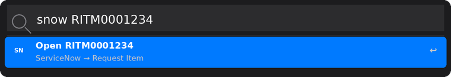
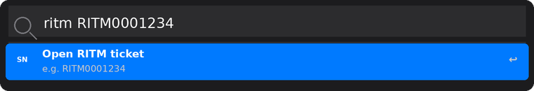

# Alfred ServiceNow Opener

Open any ServiceNow ticket directly in your browser from Alfred — no tab-switching, no searching, just type the ticket number and press Enter.

[](https://www.alfredapp.com)
[](https://www.apple.com/macos)
[](LICENSE)
[](CHANGELOG.md)

---

## Overview

ServiceNow Opener is an [Alfred](https://www.alfredapp.com) workflow that lets you jump to any ServiceNow ticket record in one keystroke. Type the universal keyword followed by a ticket number — the workflow detects the ticket type automatically and opens the correct record in your default browser.

Supports **RITM**, **CHG**, **DMND**, **ENHC**, **INC**, and **SNSVC** out of the box. All keywords and your ServiceNow instance are configurable without editing the workflow internals.



---

## Requirements

- [Alfred 5](https://www.alfredapp.com) with an active [Powerpack](https://www.alfredapp.com/powerpack/) licence
- macOS 12 Monterey or later
- Access to a ServiceNow instance

---

## Installation

### Option A — Alfred Gallery *(recommended)*
Search for **ServiceNow Opener** in the Alfred Gallery once it is listed, or install it directly from the Gallery page.

### Option B — Manual
1. Download `ServiceNow_Opener.alfredworkflow` from the [latest release](https://github.com/Babichonnba/alfred-servicenow-opener/releases/latest)
2. Double-click the file — Alfred will import it and open the configuration panel automatically

---

## Configuration

When you first import the workflow, Alfred will prompt you to configure it.

| Field | Required | Default | Description |
|---|---|---|---|
| ServiceNow Instance | ✅ | `google` | Subdomain of your instance (e.g. `google` for `google.service-now.com`) |
| Universal Keyword | — | `snow` | Keyword that accepts any ticket type |
| RITM Keyword | — | `ritm` | Dedicated keyword for Request Items |
| CHG Keyword | — | `chg` | Dedicated keyword for Change Requests |
| DMND Keyword | — | `dmnd` | Dedicated keyword for Demands |
| ENHC Keyword | — | `enhc` | Dedicated keyword for Enhancements |
| INC Keyword | — | `inc` | Dedicated keyword for Incidents |
| SNSVC Keyword | — | `snsvc` | Dedicated keyword for Mapped Application Services |

You can re-open the configuration panel at any time: right-click the workflow name in Alfred Preferences → **Configure Workflow…**

### Finding your ServiceNow instance name

Your instance name is the subdomain in your ServiceNow URL:

```
https://YOUR_INSTANCE.service-now.com
         ^^^^^^^^^^^^
```

For example, if your URL is `https://google.service-now.com`, your instance name is `google`.

---

## Usage

### Universal keyword

Type `snow` followed by any supported ticket number. Alfred detects the type automatically:

```
snow RITM0001234   → opens Request Item
snow CHG0001234    → opens Change Request
snow DMND0001234   → opens Demand
snow ENHC0001234   → opens Enhancement
snow INC0001234    → opens Incident
snow SNSVC0001234  → opens Mapped Application Service
```


### Dedicated keywords

Each ticket type also has its own keyword for direct access:

```
ritm RITM0001234
chg  CHG0001234
dmnd DMND0001234
enhc ENHC0001234
inc  INC0001234
snsvc SNSVC0001234
```



Ticket numbers are **case-insensitive** — `ritm0001234` and `RITM0001234` both work.

---

## Supported Ticket Types

| Prefix | Type | ServiceNow Table |
|---|---|---|
| RITM | Request Item | `sc_req_item` |
| CHG | Change Request | `change_request` |
| DMND | Demand | `dmn_demand` |
| ENHC | Enhancement | `rm_enhancement` |
| INC | Incident | `incident` |
| SNSVC | Mapped Application Service | `cmdb_ci_service_auto` |

---

## Adding a New Ticket Type

To add support for a ticket type not listed above (e.g. `PRB` for Problems):

1. Open **Alfred Preferences → Workflows → ServiceNow Opener**
2. Double-click the **Keyword** input object
3. Add `||{var:kw_prb}` to the end of the keyword field (using Alfred's multi-keyword syntax)
4. Double-click the **Conditional** utility object
5. Add a new condition: `{query}` **matches regex** `^PRB`
6. Add a new **Run Script** action with:
   ```bash
   #!/bin/bash
   /usr/bin/open "https://$snow_instance.service-now.com/now/nav/ui/classic/params/target/problem.do?sysparm_query=number={query}"
   ```
7. Connect the new condition branch to the new Run Script
8. Optionally add `kw_prb` as a new variable in the Workflow's Configuration

The ServiceNow table name for a given ticket type can be found in the URL when you open any record of that type in your browser.

---

## Troubleshooting

**The page opens but shows "Record not found"**
The ticket number exists but the table mapping may be wrong for your instance. Open a ticket manually in ServiceNow, note the table name in the URL (before `.do?`), and compare it against the table in the [Supported Ticket Types](#supported-ticket-types) section. Some organisations use custom tables.

**Alfred window stays open / nothing happens**
Ensure your ServiceNow instance name is correctly set in **Configure Workflow…**. An empty or incorrect instance produces a malformed URL that fails silently.

**A ticket type is not routing correctly via the `snow` keyword**
Open the **Conditional** utility in Alfred Preferences and verify each condition uses **matches regex** as the match type with the pattern `^PREFIX` (e.g. `^RITM`). The match type must be regex — other types may not evaluate correctly for all prefixes.

---

## Contributing

Issues and pull requests are welcome. When reporting a bug, please include:
- Your Alfred version (`Alfred → About Alfred`)
- macOS version
- The exact keyword and ticket number you typed
- What happened vs. what you expected

---

## Changelog

See [CHANGELOG.md](CHANGELOG.md).

---

## License

[MIT](LICENSE) © BABICHONNBA
